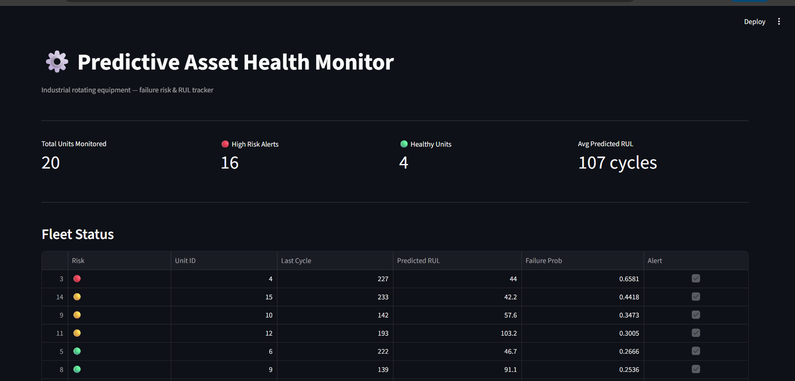
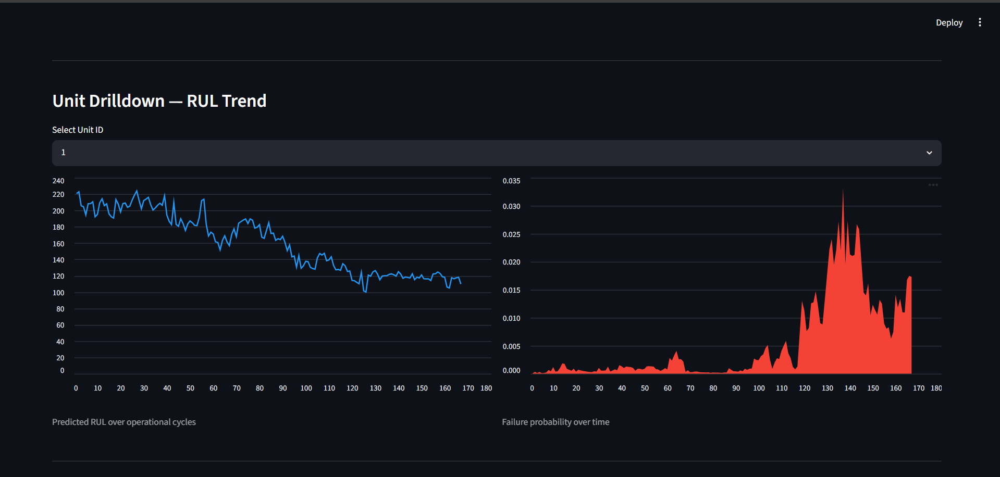
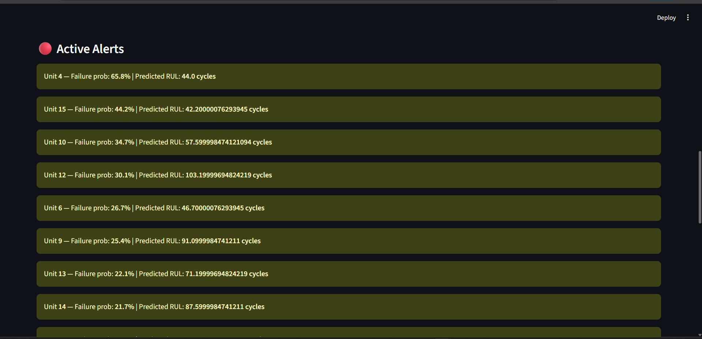
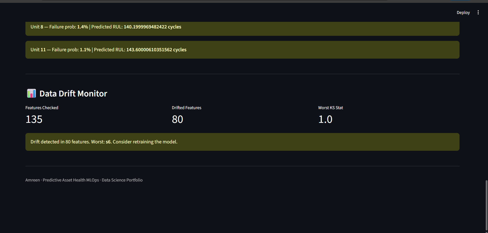
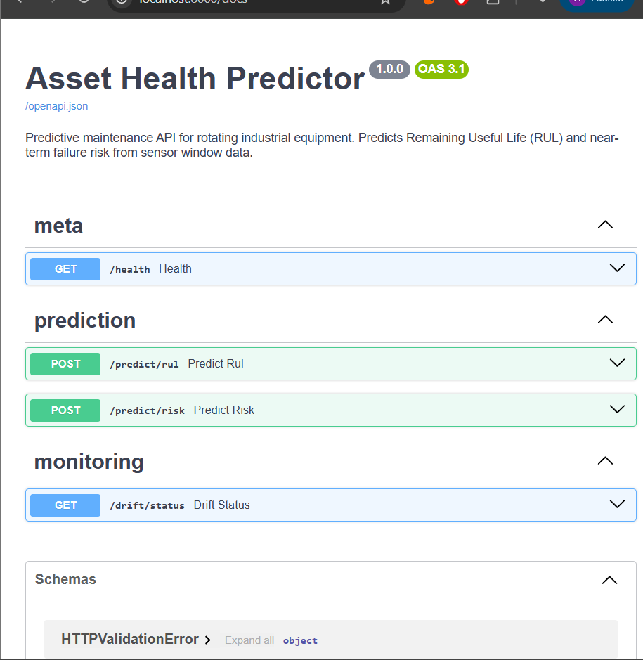
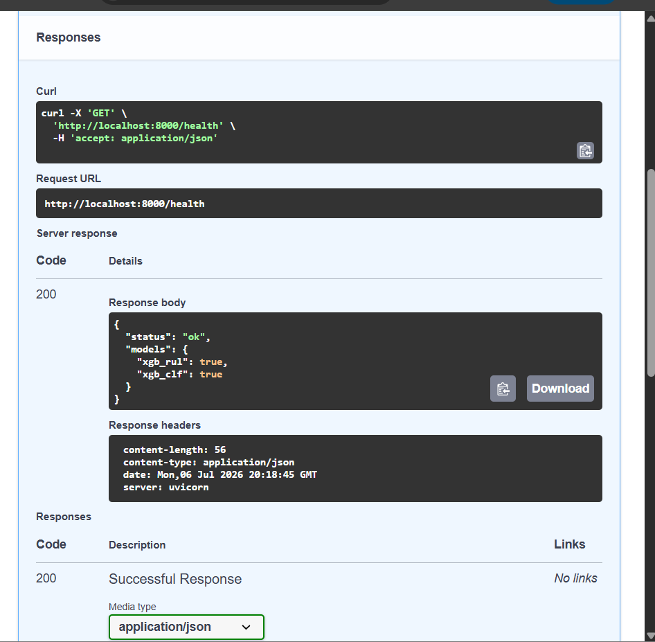
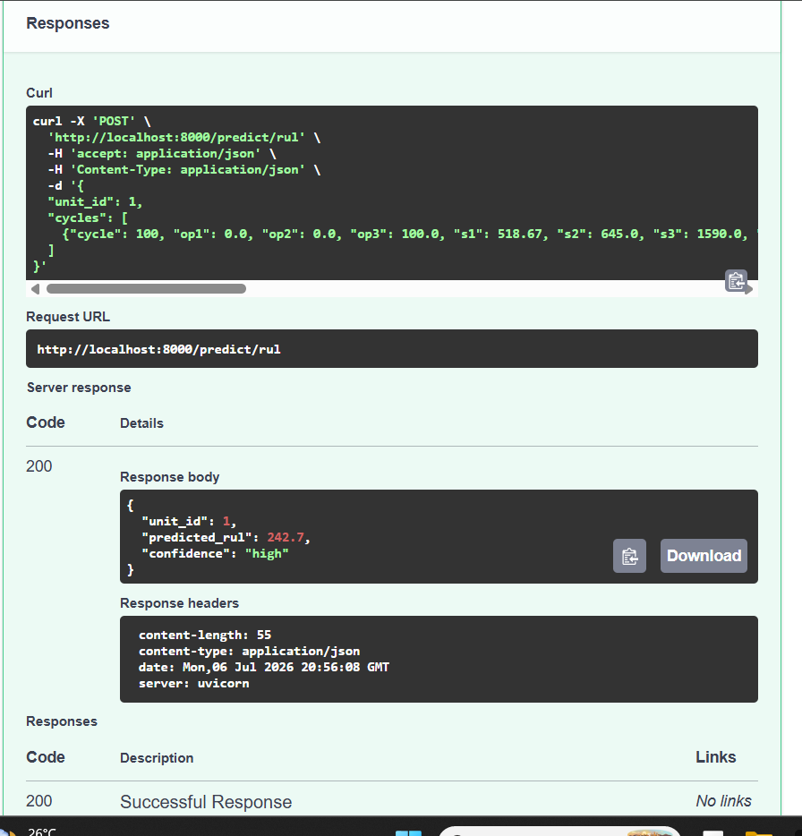

# Asset Failure Prediction MLOps


> End-to-end predictive maintenance system that predicts **Remaining Useful Life (RUL)**
> and **near-term failure risk** of industrial rotating equipment from multivariate sensor data.
> Built to production standard — REST API, live dashboard, drift monitoring, CI/CD, Docker.

**Author: Amreen**

---

## Screenshots

### Fleet Health Dashboard


### Unit Drilldown — RUL & Failure Risk Trend


### Active Alerts Panel


### Data Drift Monitor


### REST API — All Endpoints


### API — Health Check


### API — RUL Prediction Response


---

## What This Project Does

Given a stream of 21 sensor readings from an industrial engine unit, the system:

| Capability | Detail |
|---|---|
| **RUL Regression** | Predicts cycles remaining until failure (XGBoost + LSTM) |
| **Failure Risk Classification** | Binary alert — will this unit fail within 30 cycles? |
| **Cost-Based Alerting** | Threshold set by business cost matrix, not arbitrary 0.5 |
| **Drift Monitoring** | KS-test flags when live sensor data shifts from training distribution |
| **REST API** | FastAPI endpoints, auto-documented via Swagger UI |
| **Fleet Dashboard** | Streamlit — per-unit risk scores, RUL trends, active alerts |
| **CI/CD** | GitHub Actions runs 30 unit tests on every push |

---

## Architecture

```
Raw Sensor Data (CMAPSS-style)
        │
        ▼
Ingestion & Validation       schema checks, range checks, cycle continuity
        │
        ▼
Feature Engineering          rolling stats, degradation slopes, cumulative deviation
        │
   ┌────┴────────────────┐
   ▼                     ▼
RUL Regressor      Failure Classifier
(XGBoost / LSTM)   (XGBoost)
   │                     │
   └────────┬────────────┘
            ▼
   Cost-Based Risk Scoring    threshold from cost matrix
            │
   ┌────────┼────────────┐
   ▼        ▼            ▼
FastAPI  Streamlit   Drift Monitor
  API    Dashboard    (KS-test)
```

---

## Results

| Model | RMSE ↓ | NASA Score ↓ | AUC ↑ | F1 ↑ |
|---|---|---|---|---|
| Linear Regression (baseline) | ~71 cycles | ~81M | — | — |
| Logistic Regression (baseline) | — | — | 0.82 | 0.44 |
| XGBoost RUL | ~45 cycles | ~12M | — | — |
| XGBoost Classifier | — | — | 0.94 | 0.83 |
| LSTM RUL | ~38 cycles | ~8M | — | — |

**Estimated annual business impact on a 500-unit fleet: ~$3.2M net benefit**
*(Based on $50K cost per missed failure, $5K per false alarm — see `docs/model_card.md`)*

---

## Project Structure

```
asset-failure-prediction-mlops/
├── src/
│   ├── ingestion/          load_data.py, validate.py
│   ├── features/           build_features.py
│   ├── models/             baseline.py, xgboost_model.py, lstm_model.py, evaluate.py
│   ├── monitoring/         drift_check.py
│   └── serving/            api.py (FastAPI)
├── dashboard/              app.py (Streamlit)
├── notebooks/
│   ├── 01_eda.ipynb                       # sensor analysis, degradation curves
│   ├── 02_feature_engineering.ipynb       # rolling stats, slopes, RUL labels
│   ├── 03_baseline_modeling.ipynb         # linear/logistic baseline
│   ├── 04_advanced_modeling.ipynb         # XGBoost + LSTM + MLflow tracking
│   ├── 05_threshold_cost_analysis.ipynb   # cost-based threshold selection
│   └── 06_drift_analysis.ipynb            # KS-test drift simulation
├── tests/                  30 unit tests (pytest)
├── scripts/                generate_cmapss_data.py
├── docs/
│   ├── model_card.md
│   └── screenshots/
├── Dockerfile
├── docker-compose.yml
├── .github/workflows/ci.yml
└── requirements.txt
```

**Key design principle:** notebooks are for exploration only. All production logic lives in `src/` as tested, importable modules.

---

## Quickstart

```bash
# 1. Clone
git clone https://github.com/Amreen-B/asset-failure-prediction-mlops
cd asset-failure-prediction-mlops

# 2. Install dependencies
pip install -r requirements.txt

# 3. Generate dataset
python scripts/generate_cmapss_data.py --out data/raw

# 4. Run notebooks in order (01 → 06)
jupyter notebook notebooks/

# 5. Run tests
pytest tests/ -v

# 6. Start API
uvicorn src.serving.api:app --reload --port 8000
# Swagger docs → http://localhost:8000/docs

# 7. Launch dashboard
streamlit run dashboard/app.py
# Dashboard → http://localhost:8501
```

### Docker

```bash
docker-compose up --build
# API       → http://localhost:8000/docs
# Dashboard → http://localhost:8501
```

---

## API Reference

| Method | Endpoint | Description |
|---|---|---|
| GET | `/health` | Liveness check + model load status |
| POST | `/predict/rul` | Predicted RUL in cycles + confidence |
| POST | `/predict/risk` | Failure probability + alert flag |
| GET | `/drift/status` | Latest drift check summary |

**Predict RUL — example request:**
```bash
curl -X POST http://localhost:8000/predict/rul \
  -H "Content-Type: application/json" \
  -d '{
    "unit_id": 1,
    "cycles": [{
      "cycle": 100, "op1": 0.0, "op2": 0.0, "op3": 100.0,
      "s1": 518.67, "s2": 645.0, "s3": 1590.0, "s4": 1410.0,
      "s5": 14.62, "s6": 21.6, "s7": 555.0, "s8": 2390.0,
      "s9": 9050.0, "s10": 1.3, "s11": 47.5, "s12": 522.0,
      "s13": 2390.0, "s14": 8140.0, "s15": 8.32, "s16": 0.03,
      "s17": 392.0, "s18": 2388.0, "s19": 100.0, "s20": 38.9,
      "s21": 23.4
    }]
  }'
```

**Response:**
```json
{
  "unit_id": 1,
  "predicted_rul": 242.7,
  "confidence": "high"
}
```

---

## Dataset

**NASA C-MAPSS Turbofan Engine Degradation Simulation**

- 21 sensor channels per engine unit, multiple engines run to failure
- 6 sensors identified as flat/uninformative and dropped during feature engineering
- Synthetic generator included — runs out of the box with no downloads required

```bash
python scripts/generate_cmapss_data.py --out data/raw
```

To use the real NASA dataset, place `train_FD001.txt`, `test_FD001.txt`, and
`RUL_FD001.txt` in `data/raw/` — the loader handles both formats automatically.

---

## Key Design Decisions

**Grouped train/val split** — split by `unit_id`, not by row. The same engine never appears in both train and validation sets. Random row splits leak temporal information and inflate metrics artificially.

**Cost-based threshold** — classification threshold chosen by minimising expected operational cost, not by maximising F1. In industrial maintenance a missed failure costs ~10× more than a false alarm. Threshold is computed in notebook 05 and saved to `models/artifacts/best_threshold.json`.

**NASA asymmetric scoring** — alongside RMSE, the NASA score penalises late RUL predictions more than early ones. Predicting an engine will last longer than it does is operationally riskier than predicting failure early.

**Drift monitoring** — KS-test per feature compares incoming production data against the training distribution. Flags retraining when >20% of features drift significantly.

---

## Tests

```bash
pytest tests/ -v
```

30 tests covering schema validation, missing value detection, rolling feature correctness, no cross-unit data leakage, failure label consistency, and API endpoint structure.

---

## Tech Stack

| Category | Tools |
|---|---|
| Modeling | XGBoost, PyTorch (LSTM), scikit-learn |
| Serving | FastAPI, Uvicorn |
| Dashboard | Streamlit |
| Testing | pytest |
| CI/CD | GitHub Actions |
| Containers | Docker, docker-compose |
| Data | pandas, numpy, scipy |

---

## Docs

- [`docs/model_card.md`](docs/model_card.md) — model assumptions, metrics, limitations, retraining trigger

---
